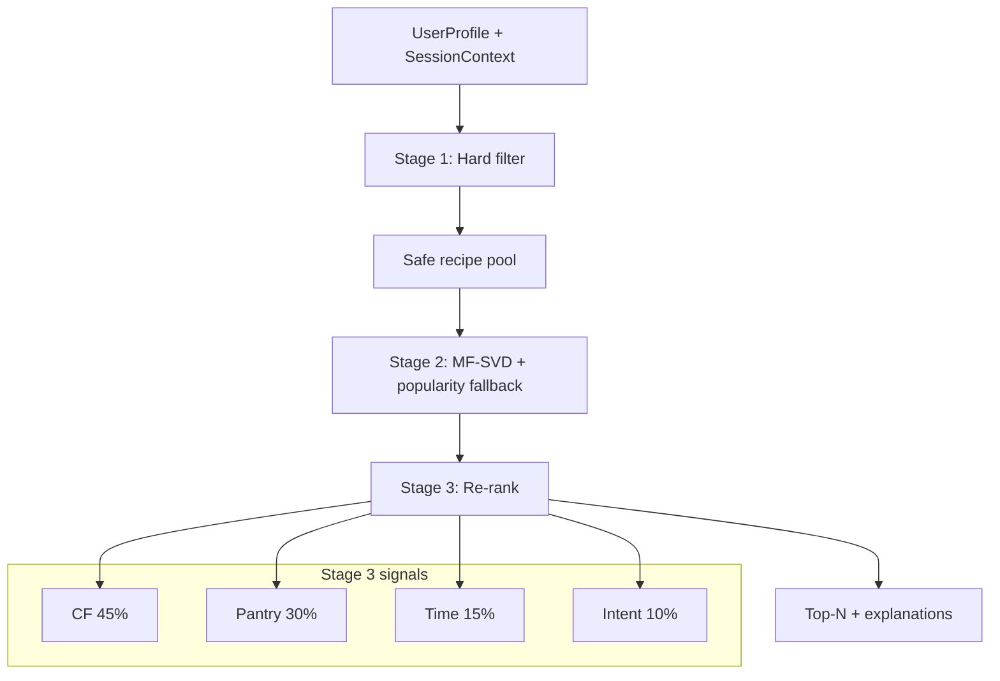

# CookMatch — Project Summary

**Repository:** [YUV3571/cookmatch-recipe-recommender](https://github.com/YUV3571/cookmatch-recipe-recommender)  
**Dataset:** Food.com (231k recipes, ~699k train interactions, 7k validation hold-outs)  
**Goal:** Safety-constrained hybrid recommender — not rating-only. Three query modes: pantry, time budget, meal intent.

---

## Architecture (what we built)

| Layer | Module | Role |
|-------|--------|------|
| **Stage 1** | `src/filter/` | Vegan/vegetarian + nuts/dairy/gluten hard filter |
| **Stage 2** | `src/recommend/stage2.py`, `cf_model.py` | Truncated SVD (20 factors) on user–recipe ratings; cold-start → Bayesian popularity |
| **Stage 3** | `src/recommend/stage3.py` | Weighted re-rank: pantry overlap, time budget, meal-intent tags + human-readable `why` |
| **Eval** | `src/eval/offline_eval.py` | Precision/Recall/Hit/NDCG@10, constraint violation rate, ablation scenarios |
| **Colab** | `colab_init.py`, `notebooks/03_colab_full_run.ipynb` | One-click GitHub → Kaggle → train → demo → ablation |

**Knowledge graph:** Interactive architecture map in [`graphify-out/graph.html`](graphify-out/graph.html) (301 nodes, 772 edges). Core hubs: `UserProfile`, `Stage2Recommender`, `Stage3Recommender`, `run_ablation()`, `SessionContext`.

---

## What we accomplished

1. **End-to-end pipeline** from raw Food.com CSVs through three recommendation stages with explanations.
2. **59 passing unit tests** covering filters, MF, Stage 3, offline eval, and data loaders.
3. **Colab full run** — load 231k recipes, train on 30k eval catalog (~101k interactions), demo recommendations, ablation in ~15 min.
4. **Ablation table (final, working):**

| Scenario | Hit@10 | Constraint violations | Interpretation |
|----------|--------|----------------------|----------------|
| `stage3_oracle_pantry` | **1.00** | 0 | Pantry signal retrieves target with perfect context |
| `stage3_oracle_time` | **1.00** | 0 | Time signal works in isolation |
| `stage3_oracle_intent` | **1.00** | 0 | Intent signal works in isolation |
| `stage3_oracle_full` | **0.99** | 0 | Combined context nearly perfect |
| `stage3_strict_profile` | 0.00 | **0** | Safety filter holds; ranking is separate |
| `popularity_open` / `stage2_mf_open` | 0.00 | 0 | Expected on 30k slice @ Hit@10 (see below) |

5. **Eval catalog coverage:** 7023/7023 validation targets reachable in the 30k interaction-linked slice.

---

## Issues we faced — and how we solved them

### 1. Colab does not clone the repo when opening from GitHub

**Problem:** Opening the notebook from GitHub loads only the `.ipynb` file; Python source stays missing until cell 1 runs. Notebook cells themselves do not auto-update after a push.

**Solution:** `colab_init.py` bootstrap — fetch `colab_init.py` from GitHub raw first, clone repo, sync critical files, purge `sys.modules` cache, verify `pin_recipe_ids` exists. Documented: **Runtime → Restart session → cell 1 → cells 2–6**.

### 2. Ablation took 50+ minutes (then all zeros)

**Problem:** Full 231k catalog × 500 users × 7 scenarios; each Stage 3 call scored ~200k candidates. Refit duplicated cell 5 work.

**Solution:**
- `FAST_ABLATION`: 30k eval catalog via `build_eval_recipe_catalog()` (all validation targets + random train recipes)
- Reuse trained model in cell 6 (`stage3=recommender`)
- Stage 3 rerank pool: top 500 CF candidates before content scoring
- `USER_SAMPLE=100`

### 3. Ablation metrics stuck at zero (even after speed fix)

**Problem:** Three bugs compounded:
- Python **cached old modules** after re-clone (`pin_recipe_ids` missing)
- Train interactions covered full 699k but recommendations used 30k catalog
- Oracle eval used production CF weights (45%) so perfect pantry/time context was drowned out; pinned target appended at end lost tie-breaks

**Solution:**
- `purge_cached_modules()` on every `colab_init.bind()`
- `filter_interactions_to_catalog()` for MF training
- Oracle eval: signal-only weights (100% pantry/time/intent), pin target **prepended** to shortlist, full ingredient list for pantry oracle

### 4. Stale notebook cells vs fresh code

**Problem:** User saw old cell 4 (no `FAST_ABLATION`) while cloned code was current.

**Solution:** Simplified workflow to single tab after restart; cell 1 verifies code version; optional open from Files sidebar.

### 5. Demo quality vs ablation (different stories)

**Problem:** Combined ranking shows kielbasa (vegan leak), 375-min spaghetti (soft time penalty), low pantry match for pasta query — while ablation oracle rows look excellent.

**Solution (documented, not yet implemented):** Three-panel demo UI (pantry / time / intent modes) separate from combined blend. See next steps.

### 6. Git / repo hygiene

**Problem:** `src/data/` blocked by `.gitignore` `data/` rule; missing loader broke Colab.

**Solution:** Fixed gitignore; added zip fallback; raw GitHub patch for critical files.

---

## How to read the ablation (for report/slides)

- **Oracle rows (Hit ≈ 1.0):** Upper bound — “if we know the user's pantry/time/intent perfectly, Stage 3 finds the right recipe.” This validates the content signals.
- **Precision = 0.10, Recall = 1.0:** One relevant item per user; one hit in top-10 → precision 1/10, recall 100%. Correct.
- **MF/popularity = 0:** Not a bug. Hit@10 on a 30k pool means “is the one held-out recipe in the global top-10?” — probability ≈ 10/30,000 per user. Report as: *strict retrieval metric on catalog slice*.
- **Constraint violation = 0:** Stage 1 safety guarantee holds under strict vegan + allergen profile.

---

## Next steps

### A. Three-panel demo UI (presentation priority)

**What:** Same user profile, three side-by-side lists instead of one combined ranking:

| Panel | Query mode | Context |
|-------|------------|---------|
| Pantry | “What can I cook with what I bought?” | `pantry=[tomato, pasta, garlic]` |
| Time | “I have 30 minutes” | `max_minutes=30` |
| Intent | “I want a main dish” | `meal_intent=main` |

Optional fourth panel: **Combined** (current behavior).

**Why:** Combined CF-heavy ranking undersells Stage 3 in live demos. Separate panels match the three stories in the project pitch and align with oracle ablation scenarios.

**Implementation:** `config/query_modes.py` weight presets; `recommend_mode(profile, mode, ...)`; Streamlit or notebook cells with three columns.

### B. Kielbasa / vegan filter fix

**What:** `kielbasa with tomatoes and white beans` appears for `diet=vegan` — meat keyword leak.

**Fix:** Add `kielbasa`, `sausage`, and related terms to `MEAT_KEYWORDS` in `config/constraints.py`; add regression test with that recipe id.

**Impact:** Restores trust in Stage 1 for vegan demo profile.

### C. Hard time cap for time-mode

**What:** 375-minute spaghetti sauce ranks in top-5 when `max_minutes=30` because time is a soft penalty (`max/minutes`), not a hard filter.

**Fix for time query mode:** Before re-rank, filter `minutes <= max_minutes`. Keep soft penalty for combined mode only.

**Impact:** Time panel and time oracle demo become visually convincing.

---

## Key files

| File | Purpose |
|------|---------|
| [`notebooks/03_colab_full_run.ipynb`](notebooks/03_colab_full_run.ipynb) | Colab end-to-end run |
| [`src/eval/offline_eval.py`](src/eval/offline_eval.py) | Ablation + oracle eval |
| [`colab_init.py`](colab_init.py) | Colab bootstrap + import cache purge |
| [`graphify-out/graph.html`](graphify-out/graph.html) | Interactive architecture graph |
| [`graphify-out/GRAPH_REPORT.md`](graphify-out/GRAPH_REPORT.md) | Graph communities + god nodes |

---

## Colab link

https://colab.research.google.com/github/YUV3571/cookmatch-recipe-recommender/blob/main/notebooks/03_colab_full_run.ipynb

**Run order:** Runtime → Restart session → cell 1 → cells 2–6.
